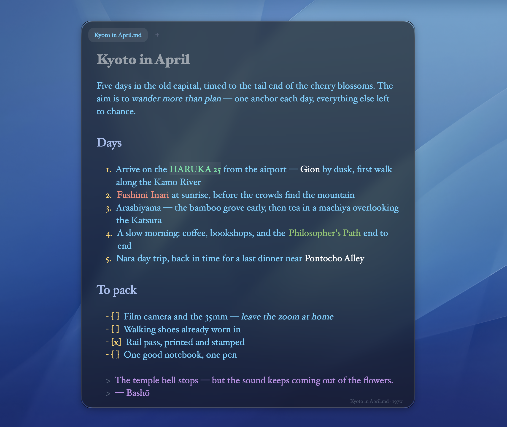

# Write



A markdown editor ... but with vibes

## Build & install

```
make run       # build, bundle, and launch dist/Write.app
make install   # copy to /Applications
make test      # headless editing-behavior tests
```

Requires only Xcode Command Line Tools (`swift` + `make`). The bundle picks
up `Support/AppIcon.icns` automatically, so a fresh clone builds with the
app icon in place.

## Editing

- Click anywhere to place the cursor, like Word or Pages.
- Obsidian-style live preview: markdown renders in place and syntax markers
  (`#`, `**`, backticks, link URLs) are hidden except on the paragraph the
  cursor is on, where they reappear dimmed for editing.
- Windows and tabs: ⌘N opens a window, ⌘T a tab; ⌘W or the hover × closes a
  tab, ⇧⌘W the window; ⌘⇧] / ⌘⇧[ or ⌃⇥ cycle tabs. Drag a tab out of the bar
  to detach it into its own window. Each tab keeps its own undo history and
  autosave; the session (windows, tabs, frames) restores on relaunch.
- Bullet / numbered / task lists and quotes continue on Enter; Enter on an
  empty item exits the list. Tab / Shift-Tab indent and outdent list items.
- Type `/` at the start of a line for the slash command menu.
- Typing at the end of a bold/italic/code/colored span continues the style,
  Word-style: the caret may sit past the concealed closing marker, but new
  characters land inside it. Typing a space exits the span.
- Documents autosave 0.8s after you stop typing (once a file has a path).
- Crash recovery: every edited buffer — including untitled ones — is mirrored
  to `~/Library/Application Support/Write/Recovery/` as you type. If the app
  crashes, is force-quit, or you just quit (⌘Q, which never prompts), your
  drafts reappear on the next launch. Closing a tab or window still asks
  before discarding an unsaved untitled buffer.
- `Write.app/Contents/MacOS/Write a.md b.md` opens each file in a tab.

## Folders, media, and file references

Use **File → Open Folder…** (⌥⌘O), choose a folder in Open (⌘O), or pass a
folder on the command line. Opening a folder adds a gallery tab and a sidebar;
existing tabs, including files outside that folder, stay open. Each window has
one active folder. Opening another folder replaces its sidebar and adds a tab.
The folder, sidebar width, collapsed state, and Files/Media mode restore with
the session. **File → Close Folder** removes the sidebar and keeps your tabs.

- **Files** (document symbol) shows the directory tree. Click a Markdown or text
  file to edit it, an image to view it fitted to the window with its aspect ratio
  preserved, or another file to see “Rendering not yet supported.”
- Drag the sidebar's right edge to resize it. The leftmost tab-bar button
  collapses or expands it without moving. Dragging nearly closed also collapses it.
- **Media** (image symbol) shows folders only. Click a folder to browse images
  throughout its subtree, grouped by containing folder under clickable breadcrumb
  headings. Click an image to animate into its own preview tab; click a folder in
  its breadcrumb to return to that gallery. Galleries remember their scroll position.
  In Files mode, image previews have no title or breadcrumb.
- Galleries decode only visible thumbnails, sized for the display's pixel density.
  Offscreen requests are cancelled and reusable cells release their images. A 64 MB
  decoded thumbnail cache and a 256 MB disk cache under `~/Library/Caches/com.grant.write/`
  avoid repeated decoding; editing a source invalidates its cached thumbnail.
  Opened images use a separate queue and the original native resolution, with no
  lossy re-encoding or preview-size cap. Original pixels are released on leaving
  the viewer and never stored in the thumbnail caches.
- Sidebar controls align with the tabs; the collapse control points in the direction
  it will move. Overflowing tabs scroll horizontally through the window's right edge.
- The tree refreshes when the window regains focus. Right-click it and choose
  **Refresh Folder** to update it while working. Hidden files and directories are
  omitted; the reference index does not follow symlinks or enter app packages.

With a folder open, type **@** after whitespace or at the start of a line, then
search by filename or path. Use ↑/↓ and Return/Tab, or click a result; Escape
cancels. Any file type can be referenced. Unsaved notes ask for a save location
before inserting a reference. Tags appear bold royal blue. Click one to open its
file in a tab (or focus its existing tab); Option-click places the editing caret.

References are ordinary Markdown, for example:

```markdown
See [@Design.md](../notes/Design.md) and [@Sketch.png](../media/Sketch.png).
```

The opened folder defines the **search scope**, not the link's origin. Each
link destination is relative to the Markdown file containing it, with special
characters percent-encoded. Opening a higher-level folder therefore needs no
migration; moving the entire project together also preserves its links. Agents
can parse Markdown links, decode their paths, resolve them against the source
file's directory, and traverse the graph without Write or a separate index.
Existing references also open when the source file is opened on its own.
Moving or renaming individual files externally requires updating their links,
just as with ordinary Markdown links.

## Shortcuts

| Key | Action |
| --- | --- |
| ⌘B / ⌘I / ⌘E | bold / italic / inline code (wraps selection or word at caret) |
| ⌘K | insert link |
| ⌘1–⌘6, ⌘0 | set / clear heading level |
| ⌘= / ⌘− | bigger / smaller text |
| ⌘N ⌘T ⌘O ⌘S ⇧⌘S | new window / new tab / open / save / save as |
| ⌘W / ⇧⌘W | close tab / close window |
| ⌘F | find |
